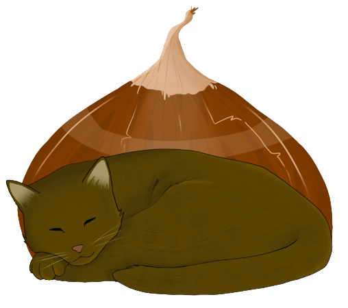

___
## Intrigue

Châtaigne, petit chat de couleur marron, s’est endormi dans une prairie d’un village avoisinant. 
Soudain, l'Humaine l’appelle, c’est l’heure de se lever rejoindre sa gamelle!
Ce que le matou ne sait pas encore, c’est que le mechant Dobermann est à ses trousses.
Châtaigne devra esquiver les fils barbelés et échapper à Hadès, son ennemi.

## Personnages

### Chataigne

Châtaigne, chat de couleur marron, sans réelle appartenance hors la gentille poissonnière. 
Il est svelte, souple et est plutôt téméraire.
Il est capable de sauter de plateforme en plateforme, grimper des murs, se faufiler dans les barbelés, il attaque avec ses griffes acérés et dash grâce à ses puissantes pattes arrières.

### Hades

Hadès est un grand et fière Dobermann, son maître l’a malencontreusement lâché pendant une balade, et le voici seul à errer dans les rues, à mener sa propre loi, il a une dent contre le matou, et lui fera comprendre en le traquant.
Il est 3 fois plus grand que le matou et est surtout plus rapide.

## Contributeurs

[Solene GARCIA](https://github.com/SoleneGARCIA) : Creatrice, Game Designeuse, Directrice Artistiaue, Artiste principale, Animatrice, Naratrice. (Elle est trop forte xD)

[Djalim Simaila](https://github.com/DjalimSimaila) : Programmeur principal
